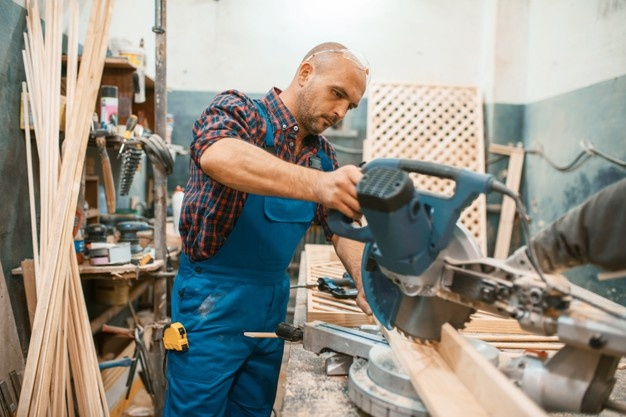

# Factory Saftey System

<picture>
  
</picture>

### Introdction

Factory safety is essential to protect workers, prevent accidents, and maintain productivity. It ensures the well-being of employees, prevents injuries, and promotes compliance with safety regulations. Implementing safety measures and fostering a culture of safety helps create a secure work environment and minimize risks, resulting in a productive and thriving factory.

### System Design

<picture>
  
</picture>

### Team:
* [Tala Shweiki](https://github.com/talashweiki)
* [Zaina Musleh](https://github.com/Zainamusleh)
* [Hala Kharouf](https://github.com/hala214)

### Code
* Sender :
[click here](dc.motor.sender-main-1.py)
* Receiver :
[click here](receiver-main.py)

